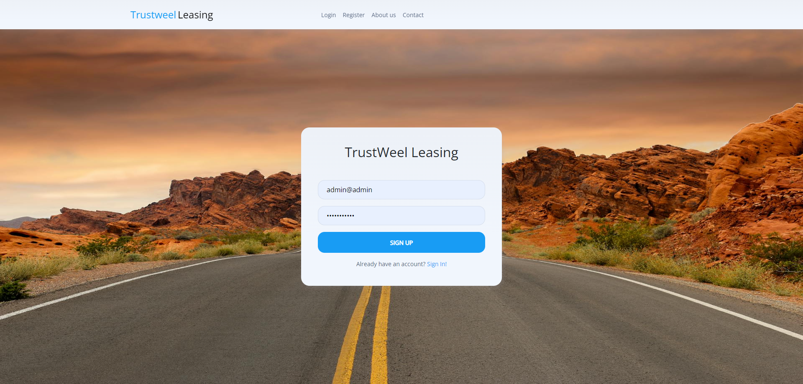

Fluffy Paw: A Comprehensive Veterinary Appointment Platform

Fluffy Paw is a user-friendly digital platform tailored for seamless veterinary appointments. Catering to various user roles, the system ensures a streamlined process for both pet owners and clinic staff.

Users (Pet Owners):
    Book an appointment with ease.
    View and manage their appointments: reschedule, modify timings, or cancel if necessary.

Secretary:
    Oversee and manage all appointments: confirm bookings, make necessary adjustments, or delete them as required.
     Access their schedule to view upcoming appointments.
     Review detailed patient records, ensuring they are well-informed before each session.
     Log pet examinations, maintaining a thorough record for future reference.

Doctors:
    

<h3>Technologies:</h3>
    
Laravel, Html, Bootstrap, Jquery, Javascript, Php Sql

<h4>Homepage</h4>

 

<h4>Registration</h4>

 

<h4>Users can book an appointment with the clinic.</h4>

 

<h4>Users can see their appointments, edit the hours of the appointment, or cancel it all together.</h4>

 

<h4>Secretary role can confirm, edit or delete appointments</h4>

 

<h4>Doctor role can check their upcoming appointments, view patient records and insert a pet examination if needed.</h4>

