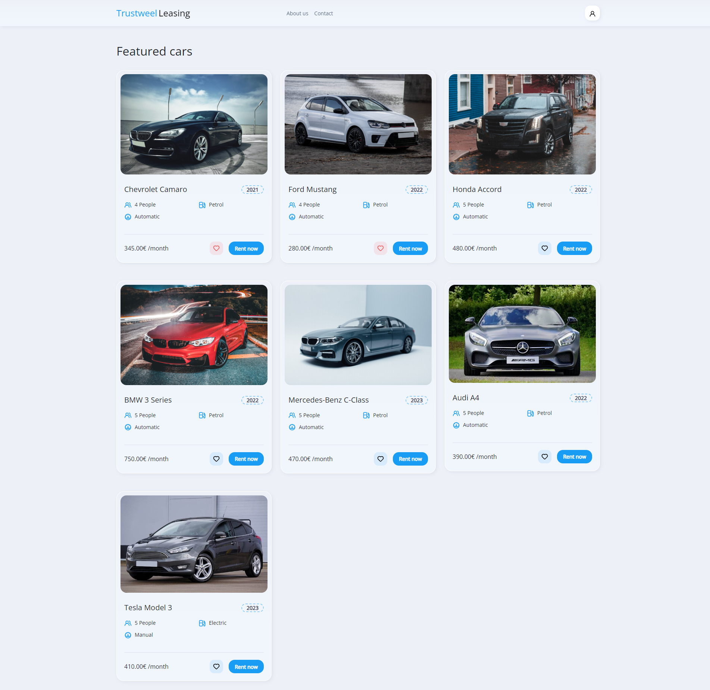

Trustweel Leasing: A Simplified Car Leasing Web Platform

User Features:

Login System: Users can create a personal account for a secure and personalized experience.
Car Rental: A straightforward process to browse and lease vehicles, tailored to user preferences and needs.
Order History: Easy access to view past orders, helping users track their leasing history and manage ongoing rentals.
Favorites: Allows users to mark and revisit their preferred vehicles for future leases.

Administrator Features:

Admin Dashboard: A centralized hub for administrators to manage the vehicle fleet and user interactions.
Vehicle Management: Tools to add, edit, or remove vehicles from the platform, ensuring the vehicle listings are up-to-date and meet user demand.
Real-Time Updates: Capability for admins to instantly update vehicle details and availability, reflecting changes directly to the users.
    

<h3>Technologies:</h3>
    
React, Laravel, Scss, Bootstrap, Html, Sql

<h4>Homepage</h4>

 

<h4>Registration</h4>

 

<h4>Users can book an appointment with the clinic.</h4>

 

<h4>Users can see their appointments, edit the hours of the appointment, or cancel it all together.</h4>

 

<h4>Secretary role can confirm, edit or delete appointments</h4>

 

<h4>Doctor role can check their upcoming appointments, view patient records and insert a pet examination if needed.</h4>

